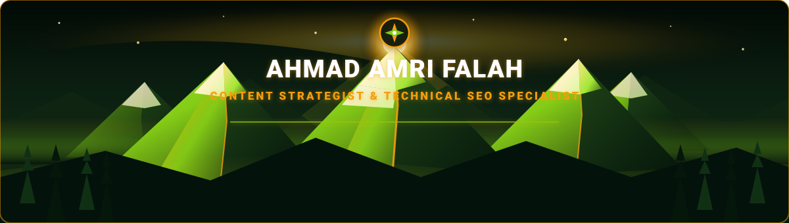

<!-- Mountain Peak Profile Header Banner -->

## 🌲 About Me | Tentang Saya

Halo, saya Ahmad Amri Falah 👋! Content Strategist & Technical SEO Specialist. Saya berpengalaman mengubah situasi yang membutuhkan keteraturan dan hasil terukur menjadi strategi konten yang benar-benar mendatangkan trafik dan konversi nyata.

Fokus utama saya mencakup SEO Lokal & Google Business Profile, riset kata kunci (SEMrush, Google Keyword Planner, Ubersuggest), Content Writing & Strategy untuk AI Overview (SGE) Google, Technical SEO (optimasi skema artikel & HTML/CSS manual di CMS Laravel), serta Landing Page & Meta Ads berkonversi tinggi.

### 🎯 Core Capabilities & Value Proposition

- 🎯 Teliti & Terorganisir: Menyukai rencana yang jelas, kalender konten berbasis data, dan konsisten menepati komitmen.
- 🔥 Gigih & Berkelanjutan: Tidak mudah menyerah menghadapi rintangan algoritma dan selalu menyelesaikan apa yang sudah dimulai.
- 🌱 Berorientasi pada Pertumbuhan: Percaya kemampuan bisa terus dikembangkan lewat usaha, eksperimen, dan strategi yang lebih baik.
- 💡 Dampak Konversi Nyata: Mengutamakan hasil yang bermanfaat (prospek B2B, panggilan bisnis riil), bukan sekadar vanity metrics.

## 📊 SEO & Content Peak Achievements

| Metric | Value | Impact & Focus Area |
| :--- | :---: | :--- |
| **Alatan Asasta B2B Leads** | `14 Lead & +722%` | Prospek B2B & unduhan regulasi dari 18 ke 148 |
| **Laundry Express Mamamu** | `#1 Google Maps` | 254 panggilan bisnis per bulan dari GBP |
| **Toko Kue A Tiga** | `Hal. 1 Google` | Tembus Halaman 1 Google untuk 3 kata kunci dalam 2 bulan |
| **Sertifikasi SEO & Writing** | `4 Certification` | Semrush, Google Skill, MySkill & Impactful Writer |

## 🚀 Featured Case Studies & Projects | Proyek Unggulan

### 🏢 Alatan Asasta Indonesia
*Category: `B2B Technical SEO & Content Strategy`* | **Impact:** `14 Prospek B2B/Gov & +722% Downloads`

Merancang strategi konten TOFU/MOFU/BOFU berbasis data CSO & webinar. Menghasilkan 14 prospek organik B2B/pemerintahan, menaikkan unduhan regulasi dari 18 ke 148 (+722%), menjaga CTR GSC di angka 2%, serta menulis kode HTML/CSS manual pada CMS Laravel untuk optimasi skema artikel & PageSpeed Insights.

**Tech & Tools:** `CMS Laravel` • `Technical SEO` • `SEMrush` • `Schema Markup` • `HTML/CSS` • `Lead Magnet`

[🌐 View Live Project](https://portofolio-seo-specialist.ahmad-amri-falah.workers.dev/)

---

### 🧺 Laundry Express Mamamu
*Category: `Local SEO & Google Business Profile`* | **Impact:** `#1 Google Maps & 254 Calls/Bulan`

Optimasi Google Business Profile hingga meraih Peringkat #1 di Google Maps dan menghasilkan 254 panggilan bisnis per bulan. Menyusun strategi konten SEO lokal komprehensif dan penulisan artikel LinkedIn.

**Tech & Tools:** `Google Business Profile` • `Local SEO` • `Keyword Research` • `LinkedIn Content Strategy`

[🌐 View Live Project](https://portofolio-seo-specialist.ahmad-amri-falah.workers.dev/)

---

### 🧁 Toko Kue A Tiga
*Category: `SEO Content & Landing Page Builder`* | **Impact:** `Halaman 1 Google dalam 2 Bulan`

Membawa website dari tidak terindeks menjadi Halaman 1 Google untuk 3 kata kunci produk utama dalam waktu 2 bulan. Membuat landing page WhatsApp yang terkonversi dan meningkatkan trafik organik lewat internal linking.

**Tech & Tools:** `Landing Page Builder` • `WhatsApp Conversion` • `Internal Linking` • `On-Page SEO`

[🌐 View Live Project](https://portofolio-seo-specialist.ahmad-amri-falah.workers.dev/)

---

### 🏠 Groperti - Content Writer Intern
*Category: `SEO Property Content Writing`* | **Impact:** `Peningkatan CTR Organik Blog`

Menulis konten blog sesuai target keyword dalam strategi SEO properti, menyusun judul & meta description untuk meningkatkan CTR organik.

**Tech & Tools:** `SEO Writing` • `Keyword Research` • `Meta Descriptions` • `Property Niche`

[🌐 View Live Project](https://portofolio-seo-specialist.ahmad-amri-falah.workers.dev/)

---

## 🌄 Dynamic Daily SEO & Mountain Quote

> <!-- DAILY_QUOTE_START -->
> *"SEO is not about gaming the system. It is about delivering high altitude value to the searcher, one peak at a time."*
> 
> 💡 **Today's SEO Mountain Tip**: Optimize for search intent before search volume. High altitude relevance always beats mass traffic noise.
> <!-- DAILY_QUOTE_END -->

*🔄 Auto-updated daily at 00:00 UTC via [GitHub Actions](./.github/workflows/daily-quote.yml)*

## 🛠️ Arsenal & Tech Stack | Perlengkapan SEO & Penulisan

### 🔍 SEO & Analytics Suite

  
  
  
  
  
  

### 💻 Technical SEO & Content Strategy

  
  
  
  
  

### 🏆 Sertifikasi Resmi

  
  
  
  

## 📬 Connect & Collaborate | Link Media Sosial

  
  
  
  
  

---

⚡ Profile README generated with **Mountain Dark Green Aesthetic README Generator**

